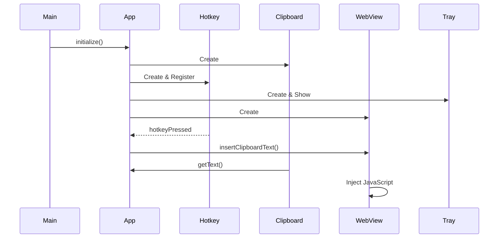

# Developer Guide

This guide provides detailed information for developers working on the TinyTools application.

## Table of Contents

1. [Architecture Overview](#architecture-overview)
2. [Coding Standards](#coding-standards)
3. [Component Interaction](#component-interaction)
4. [Adding New Features](#adding-new-features)
5. [Testing Guide](#testing-guide)
6. [Debugging](#debugging)
7. [Performance Optimization](#performance-optimization)

## Architecture Overview

### Design Patterns Used

1. **Observer Pattern**: Signal-slot mechanism for loose coupling
2. **Singleton Pattern**: Configuration manager (optional)
3. **Factory Pattern**: Component creation in Application class
4. **Strategy Pattern**: Different hotkey implementations per platform

### Layered Architecture

```
┌─────────────────────────────────────┐
│         Presentation Layer          │
│  (MainWindow, SettingsDialog, etc.) │
├─────────────────────────────────────┤
│         Business Logic Layer        │
│  (ClipboardManager, HotkeyManager) │
├─────────────────────────────────────┤
│         Data Access Layer          │
│       (AppConfig, Storage)         │
├─────────────────────────────────────┤
│         System Layer               │
│    (Qt Framework, Win32 API)       │
└─────────────────────────────────────┘
```

## Coding Standards

### C++ Style Guide

#### Naming Conventions

```cpp
// Classes: PascalCase
class ClipboardManager { };

// Functions: camelCase
QString getText() const;

// Member variables: m_ prefix with camelCase
QString m_lastText;

// Constants: UPPER_SNAKE_CASE
static const int MAX_TEXT_LENGTH = 10000;

// Private methods: camelCase, no prefix
void onClipboardChanged(QClipboard::Mode mode);

// Signals: camelCase, past tense if appropriate
void clipboardChanged(const QString& text);
```

#### File Organization

```cpp
// Header file (.h)
#pragma once

#include <QObject>

class MyClass : public QObject {
    Q_OBJECT
    
public:
    explicit MyClass(QObject* parent = nullptr);
    ~MyClass();
    
    // Public methods
    
public slots:
    // Public slots
    
signals:
    // Signals
    
protected:
    // Protected methods
    
private:
    // Private methods
    
private slots:
    // Private slots
    
private:
    // Member variables
    
    // Disable copy
    Q_DISABLE_COPY(MyClass)
};
```

#### Memory Management

```cpp
// Use QPointer for QObject-owned pointers
QPointer<MainWindow> m_mainWindow;

// Use smart pointers for non-QObject
std::unique_ptr<NetworkMonitor> m_networkMonitor;

// Use Qt's parent-child system where possible
auto* widget = new QWidget(parent);

// Clean up in destructor
MyClass::~MyClass() {
    // QPointer automatically nullifies
    // Parent-child system handles cleanup
}
```

### Qt Best Practices

#### Signal-Slot Connections

```cpp
// Prefer modern syntax (Qt 5+)
connect(sender, &Sender::signalName,
        receiver, &Receiver::slotName);

// Use lambda for simple operations
connect(button, &QPushButton::clicked, [this]() {
    handleButtonClick();
});

// Disconnect when necessary
disconnect(m_clipboardManager, &ClipboardManager::clipboardChanged,
           this, &Application::onClipboardChanged);
```

#### Resource Management

```cpp
// Use QSettings for configuration
QSettings settings("TinyTools", "App");
int opacity = settings.value("window/opacity", 90).toInt();

// Clean up resources
void cleanup() {
    m_webView->stop();
    m_webView->setUrl(QUrl("about:blank"));
}
```

#### Thread Safety

```cpp
// Use QMutex for shared data
class MyClass {
private:
    mutable QMutex m_mutex;
    QString m_sharedData;
    
public:
    QString getData() {
        QMutexLocker locker(&m_mutex);
        return m_sharedData;
    }
};

// Qt signals are thread-safe
// They automatically marshal across threads
```

## Component Interaction

### Application Lifecycle



### Data Flow

```
User Input (Hotkey)
    ↓
HotkeyManager (Windows API)
    ↓
Application::onHotkeyPressed()
    ↓
MainWindow::insertClipboardText()
    ↓
ClipboardManager::getText()
    ↓
WebViewContainer::insertText()
    ↓
JavaScript Injection (DOM manipulation)
    ↓
Web Resource (e.g. Google Translate)
    ↓
Translation Result (WebPage)
```

## Adding New Features

### Example: Adding a New Setting

1. **Update AppConfig.h**:

```cpp
class AppConfig {
public:
    // New setting getter
    bool getNewFeature() const;
    
    // New setting setter
    void setNewFeature(bool value);
    
private:
    // Default value in resetToDefaults()
};
```

2. **Update AppConfig.cpp**:

```cpp
bool AppConfig::getNewFeature() const {
    return m_config["general"].toObject()["newFeature"].toBool(false);
}

void AppConfig::setNewFeature(bool value) {
    m_config["general"].toObject()["newFeature"] = value;
}

void AppConfig::resetToDefaults() {
    // ...
    general["newFeature"] = false;
    m_config["general"] = general;
}
```

3. **Add to SettingsDialog**:

```cpp
// SettingsDialog.h
QCheckBox* m_newFeatureCheckBox;

// SettingsDialog.cpp
void SettingsDialog::createUI() {
    // ...
    m_newFeatureCheckBox = new QCheckBox("Enable New Feature");
    layout->addWidget(m_newFeatureCheckBox);
    
    connect(m_newFeatureCheckBox, &QCheckBox::toggled,
            this, [this](bool checked) {
                m_config.setNewFeature(checked);
                m_config.save();
            });
}

void SettingsDialog::loadSettings() {
    // ...
    m_newFeatureCheckBox->setChecked(m_config.getNewFeature());
}
```

4. **Use in Application**:

```cpp
void Application::initialize() {
    // ...
    if (m_config.getNewFeature()) {
        initializeNewFeature();
    }
}
```

## Testing Guide

### Unit Tests

#### Creating a Test Class

```cpp
// tests/unit/test_example.cpp
#include <QtTest>
#include "core/ClipboardManager.h"

class TestExample : public QObject {
    Q_OBJECT
    
private slots:
    void initTestCase();    // Called before all tests
    void cleanupTestCase(); // Called after all tests
    void init();           // Called before each test
    void cleanup();        // Called after each test
    
    void testFeatureOne();
    void testFeatureTwo();
};

void TestExample::initTestCase() {
    // Setup for all tests
}

void TestExample::cleanupTestCase() {
    // Cleanup for all tests
}

void TestExample::init() {
    // Setup for each test
}

void TestExample::cleanup() {
    // Cleanup for each test
}

void TestExample::testFeatureOne() {
    // Test implementation
    QVERIFY(condition);
    QCOMPARE(actual, expected);
}

QTEST_MAIN(TestExample)
#include "test_example.moc"
```

#### Running Tests

```bash
# Run all tests
cd build/tests
ctest --config Release --output-on-failure

# Run specific test
./unit/test_clipboard.exe

# Run with verbose output
ctest -V
```

## Debugging

### Logging Strategy

```cpp
// Use Qt's logging categories
Q_LOGGING_CATEGORY(appLog, "tinytools.app")
Q_LOGGING_CATEGORY(webViewLog, "tinytools.webview")
Q_LOGGING_CATEGORY(clipboardLog, "tinytools.clipboard")

// In code
qCDebug(appLog) << "Application initialized";
qCWarning(webViewLog) << "Failed to load page";
qCCritical(clipboardLog) << "Clipboard access error";
```

### Enable Logging

```cpp
// In main.cpp
QLoggingCategory::setFilterRules(
    "tinytools.*.debug=true\n"
    "qt.webengine*.debug=false"
);
```

## Performance Optimization

### WebView Performance

```cpp
// In WebViewContainer constructor
void optimizeWebView() {
    QWebEngineSettings* settings = page()->settings();
    
    // Enable hardware acceleration
    settings->setAttribute(QWebEngineSettings::Accelerated2dCanvasEnabled, true);
    
    // Disable unused features
    settings->setAttribute(QWebEngineSettings::WebGLEnabled, false);
    settings->setAttribute(QWebEngineSettings::AutoLoadIconsForPage, false);
    
    // Optimize for text
    settings->setAttribute(QWebEngineSettings::PluginsEnabled, false);
}
```
